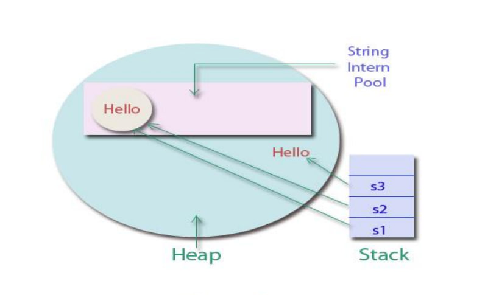

# String Intern Pool

### String Intern pool o'zi nima?

String Intern Pool bu C\# dasturlash tilida **literal** e'lon qilingan string'lar saqlanadigan maxsus xotiraning qismi bo'lib, u **LOH**'da joylashgan bir table hisoblanadi. String bilan bog'liq operatsiyalarning ishlash tezligini oshirish va xotiradan samarali foydalanish uchun yaratilgan. String Intern Pool **String Constant Pool** deb ham ataladi.

### String'ni literal e'lon qilish nima degani?

String Intern Pool haqida chuqurroq o'rganishimizdan oldin, biz String'larni **2 xil** tarzda e'lon qilinishini ko'rib chiqishimiz zarur:

1. String'ni literal e'lon qilish: 

```csharp
 string s = "Hello, world!";
```

2. String obyektini yaratish orqali e'lon qilish:

    * **new** kalit so'zini ishlatish orqali, String class'ini constructor'ini chaqirgan holatda: 

    ```csharp
     string s = new string(new char[] { 'H', 'e', 'l', 'l', 'o', ',', ' ', 'w', 'o', 'r', 'l', 'd', '!' });
    ```
    
    * **String Builder** obyektini String obyektiga o'tkazish qilish orqali:
    
    ```csharp
     StringBuilder sb = new StringBuilder();
     sb.Append("Hello, ");
	 sb.Append("world!");
	 string s = sb.ToString();
    ```
    
    * 2 ta String obyektini **birlashtirish** orqali,.. va hokazo:
    
    ```csharp
     string s1 = "Hello, ";
	 string s2 = "world!";
	 string s = s1 + s2;
    ```

### String Intern Pool qanday ishlaydi?

* String'lar literal holatda e'lon qilinganda, ular avvaliga CLR tomonidan String Intern Pool'da mavjudligi tekshiriladi. Agar mavjud bo'lsa, ularning address'i bitta qilib qo'yiladi. Agar mavjud bo'lmasa, yangi string obyekti yaratiladi va uning address'i String Intern Pool'ga qo'shiladi.

* String obyektlari yaratilganda, ular String Intern Pool'da mavjud bo'lmaganligi uchun, Heap'da joylashadi. Lekin, biz **String.Intern()** method'ini chaqirib, ularni String Intern Pool'ga qo'shishimiz mumkin. Bu method string obyektini qabul qilib, uni String Intern Pool'da mavjudligini tekshiradi. Mavjud bo'lsa, ularning address'i o'sha string intern'ga reference qilib qo'yiladi, mavjud bo'lmasa, yangi string obyekti yaratiladi va uning address'i String Intern Pool'ga qo'shiladi.

```csharp
 public static string Intern (string str);
 //string obyektini String Pool'ga qo'shish.
```

```csharp
 public static string IsInterned (string str);
 //string obyektini String pool'da joylashgan yoki joylashmaganligini aniqlash.
```

* String Intern Pool'da saqlanadigan string'lar faqatgina string literals va String.Intern() method'ida berilgan string'lar bo'lib, ular hech qachon o'chirilmaydi. Bu esa, String Intern Pool'ning to'lib ketishiga olib kelishi mumkin. Shuning uchun, String.Intern() methodini juda ehtiyotkorlik bilan ishlatish kerak.


### String Intern Pool'ning afzalliklari va kamchiliklari nimalardan iborat?

* String Intern Pool'ning asosiy afzalligi string amallarini ishlash tezligini oshirishi va xotiradan samarali foydalanishidir. Agar biz bir nechta string obyektlarini bir-birini taqqoslashimiz kerak bo'lsa, biz String Intern Pool'da mavjud bo'lgan string'larning manzillarini solishtirishimiz mumkin. Bu esa, string obyektlarining qiymatlarini solishtirishdan ancha tezroq amalga oshadi va xotiradan tejash hisoblanadi.

* String Intern Pool'ning asosiy kamchiligi esa, literal string'larni o'zgaruvchan bo'lmaganligi va hech qachon o'chirilmaydiganligidir. Bu esa, String Intern Pool'ning hajmi to'lib ketishiga va xotirada ko'p joy egallashiga olib kelishi mumkin. Shuning uchun, String Intern Pool'ga faqatgina kerakli va qayta-qayta ishlatiladigan string'larni qo'shish kerak.

### Amaliyot bilan tushunish: 

Quyidagi code'da, biz String Intern Pool bilan ishlashni ko'ramiz:

```csharp
 // String'larni literal holatda yaratamiz
 string s1 = "Hello";
 string s2 = "Hello";

 // String obyektlari yaratamiz
 string s3 = new string(new char[] {'H', 'e', 'l', 'l', 'o'});

 // String'larni qiymatlarini solishtiramiz.
 Console.WriteLine("s1 == s2: {0}", s1 == s2); // true
 Console.WriteLine("s1 == s3: {0}", s1 == s3); // true
 Console.WriteLine("s2 == s3: {0}", s2 == s3); // true

 // String'larni address'larini solishtiramiz
 Console.WriteLine("ReferenceEquals(s1, s2): {0}", ReferenceEquals(s1, s2)); // true
 Console.WriteLine("ReferenceEquals(s1, s3): {0}", ReferenceEquals(s1, s3)); // false
 Console.WriteLine("ReferenceEquals(s2, s3): {0}", ReferenceEquals(s2, s3)); // false
```



Keling, endi shu String obyektimizni String Intern pool'ga olib o'tamiz)

```csharp
 // String obyektimizni String Intern Pool'ga qo'shamiz
 s3 = string.Intern(s3);
 // String'larni manzillarini solishtiramiz
 Console.WriteLine("ReferenceEquals(s1, s3): {0}", ReferenceEquals(s1, s3)); // true
 Console.WriteLine("ReferenceEquals(s2, s3): {0}", ReferenceEquals(s2, s3)); // true
```

Natija:

ReferenceEquals(s1, s3): True

ReferenceEquals(s2, s3): True

Natijadan ko'rinib turibdiki, string'lar literal holatda yaratilganda, ular String Intern Pool'da saqlanadi va ularning manzillari bir xil bo'ladi. String obyektlari yaratilganda, ular xotiraning Heap hududida saqlanadi va ularning manzillari bir biridan farq qiladi. Lekin, agar biz ularni String.Intern() method'iga berib, String Intern Pool'ga qo'shsak, ularning manzillari ham bir xil bo'ladi.

### String Intern Pool nima uchun yaratilgan?

String'lar dasturning katta qismni tashkil etadi. Dastur kodi 70% (taqriban) string'lardan tashkil topgan bo'ladi. C#'da esa string'lar immutable hisoblanadi ya'ni o'zgarmas. Dastur ichida ko'p sonli o'zgarmas string konstantalarini yaratish yoki bir xil string'ni qayta-qayta obyektlar sifatida yaratish, Heap'ga salbiy ta'sir ko'rsatadi. CLR String Intern Pool yordamida string'lardan foydalanishni optimallashtirishga yordam beradi.

**Menda 3ta bir xil literal e'lon qilingan string'im bor, ular bitta address'da joylashsa, agar men bitta string'imni qiymatini o'zgartirsam, shu holatda nima bo'ladi? Hamma string'larni qiymati o'zgaradimi?**

Yo'q, chunki String immutable type, ya'ni o'zgarmas, agar o'sha boshqa string'lar bilan qiymati bir xil bo'lgan string'ga o'zgartirish kiritilsa, masalan, **Concat** amali bajarilsa, so'z qo'shilsa, u xotiradan yangi o'zgaruvchi ochib, shu eski string'dagi qiymatni va yangi qo'shilayotgan ma'lumotni jamlab, o'sha o'zgaruvchiga biriktirib qo'yadi:

```csharp
 using System;

 public class HelloWorld
 {
     public static void Main(string[] args)
     {
         // 2ta string turiga mansub o'zgaruvchilarni e'lon qilamiz:
         string hello = "hello";
         string world = "world";

         // hello o'zgaruvchisiga 2-o'zgaruvchimizni + orqali qo'shishga harakat qilib ko'ramiz.S
	     hello+world;  //Buyerda compilyator xatolik beradi, to'g'ridan to'g'ri qiymatini o'zgatira olmasligimizni bildiradi
            
         // hello o'zgaruvchisiga 2-o'zgaruvchimizni += orqali qo'shishga harakat qilib ko'ramiz.
         hello += world;

         // Console'ga hello o'zgaruvchisining qiymatini chop etamiz
         Console.WriteLine(hello); // Output: hello world
     }
 }
```