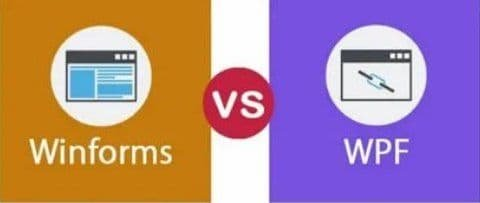

# WinForm va WPF

## **WPF haqida:**

Avvalgi darsda biz WinForms va WPF haqida ozroq gaplashdik. Bu darsda ikkalasini farqini solishtiramiz, chunki ikkalasi bir maqsadda foydalanilsa ham, farqlar katta. Agar ilgari WinForms bilan ishlamagan bo'lsangiz bu darsni tashlab ketsangiz ham bo'ladi, qiziqsangiz davom eting va kerakli ma'lumotlarga ega bo'ling.

WinForms va WPF orasidagi sodda farq shuki, WinForms standard Windows kontrollari ustiga qurilgan(masalan: TextBox), WPF esa mustaqil bo'lib noldan boshlab ishlab chiqilgan desa ham bo'ladi. Bu juda nozik farq bo'lishi mumkin aslida esa unday emas, buni biror marta Win32/WinAPI ga bog'liq bo'lgan freymvorklar bilan ishlagan bo'lsangiz sezishingiz mumkin

Zo'r bir misol sifatida ichida rasmi, matni bo'lgan button ni olsa bo'ladi. Standard Windows kontrolida bunday buttonni topolmaysiz. Aksincha buning uchun o'zingiz alohida rasm chizib button imkoniyatini qo'shishingiz kerak bo'ladi yoki 3-tomon kontrollarini ishlatishingiz kerak bo'ladi. WPF da esa button istalgan narsani ichida saqlay oladi, chunki button ma'lum chegara chizig'iga ega bo'lgan va bir necha holatlarni(masalan: bosilgan, fokus olgan, tegilmagan) saqlaydigan kontrol. Matn va rasmli buttonni xohlaysizmi? Shunchaki rasm va matn controlini button ichiga qo'ying, yetarli! Bunday qulayliklarni WinFormsda topa olmaysiz

Ushbu qulaylikning kamchiligi ham bor, ba'zan WinForms bilan juda oson erishiladigan narsani hosil qilish uchun WPF da ko'proq ishlash kerak bo'ladi, chunki WinFormsda siz uchun zarur bo'lgan ssenariy yaratilgan. WinForms da ListViewItem kodining bitta satrida bajaradigan narsa, WPF da ListView ni rasm va bir-biriga moslashtirilgan matn bilan ishlash uchun shablonlarni yaratasiz, bu narsa toki shablonlarni bir marta tayyorlab olganingizdagina bo'ladi qolgan payt shablonni ishlataverasiz

Bu faqat birgina farq, lekin WPF bilan ishlar ekansiz, turli boshqa farqlarni ham aniqlaysiz, o'ziga yarasha yaxshi va yomon tomonlarini ko'rasiz. WPF ning imkoniyatlaridan foydalanganda Windows qo'ygan cheklovlar unutiladi, lekin ishni aynan Windows qilgani kabi qilmoqchi bo'lsangiz bunda ko'proq vaqt va ish qilishingizga to'g'ri keladi

Quyida WPF va WinForms ning afzalliklari haqidagi farqlar bo'lib, nimani ishlatishga kirishayotganingizni batafsil bayoni bo'lib xizmat qiladi.

## **WPF afzalliklari**

* U yangi va hozirgi standartlarga javob beradi;
* Microsoft uni juda ko'p ilovalarga ishlatadi, (masalan Visual Studio, VS Code);
* Juda moslashuvchan, ko'p narsalarni yangidan yozmasdan yoki yangi kontrollarni sotib olmasdan ishlata olasiz;
* Qachonki 3 - tomon kontrollarini ishlatmoqchi bo'lsangiz, bu kontrollarni yasagan dasturchilar ko'proq WPF ga e'tibor qaratishadi, chunki bu yangi freymvork;
* XAML grafik interfeysni yasashda va o'zgartirishda juda qulay vosita, shuningdek dizayn qismi va kod qismini ajratib ishlashga yordam beradi;
* Ma'lumotlarni joylashtirishda ma'lumot va layoutni ajratadi;
* Grafik interfeysni chizishda apparat tezlatgichini ishlatadi, bu esa ishlash tezligiga ijobiy ta'sir qiladi;
* Foydalanuvchi interfeysini Windows ilovalari uchun ham web(Silverlight/XBAP) ilovalar uchun ham ishlatish imkonini beradi.

## WinForm afzalliklari:

* Bu ancha eski va ko'p bora ishlatilgan va sinalgan;
* Allaqachon 3-tomon kontrollari bilan boy bo'lib, tekin yoki sotib olish uchun tayyor;
* Visual Studio dizayner qismi WPF dan ko'ra WinForms uchun yaxshiroq, WPF da ko'p ishlarni o'zingiz qilishingizga to'g'ri keladi.
